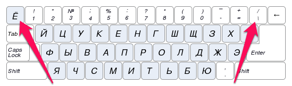
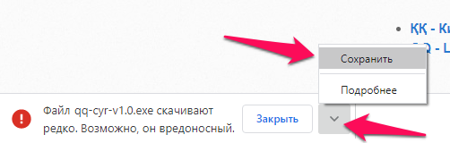
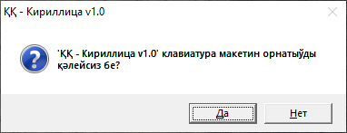
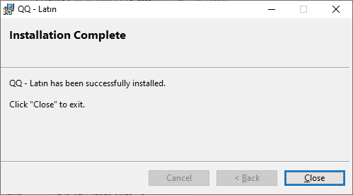
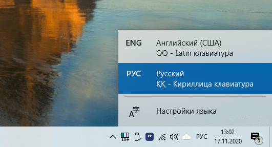

# Қарақалпақ тили клавиатура макетлери

\
Бул макетлер **Windows** операцион системаларына мөлшерленген болып,
юникод символларды көрсете алатуғын ҳәр қандай программада ислейди.

Макетлерде қарақалпақ тилине тийисли болған ҳәриплер
<a href="https://ru.wikipedia.org/wiki/%D0%9C%D1%91%D1%80%D1%82%D0%B2%D1%8B%D0%B5_%D0%BA%D0%BB%D0%B0%D0%B2%D0%B8%D1%88%D0%B8" target="_blank">жәрдемши клавишалар</a>
арқалы териледи.
Нәтийжеде, клавитурадағы ҳеш қандай ҳәрип жоғалмайды: яғный қарақалпақ кирилл макетинде "отырып" биймәлел рус тилинде,
ал қарақалпақ латын макетинде "отырып" биймәлел инглис тилинде жаза бериўге болады.

## Жәрдемши клавишалар қайсылар?

Қолайлықты асырыў мақсетинде бирдей ўазыйпаны атқарыўшы, тең күшке ийе болған еки жәрдемши клавишалар ислетилген.
Булар, клавиатураның шеп-жоқары бөлегиндеги "**`**", "**~**" ҳәм "**ё**" символлары жайласқан клавиша
ҳәмде клавиатураның оң-жоқары бөлегиндеги "**\\**", "**|**" ҳәм "**/**" символлары жайласқан клавишалар.

Төмендеги сүўретте сол жәрдемши клавишалар көрсетилген:

Бундағы және бир қолайлық, Word-қа усаған программаларда керекли ҳәриплерди **Ctrl** ҳәм **Alt**
клавишаларына байланыстыраман деп, сол клавишалардың өз ўазыйпаларын жойтып қоймайсыз.
Мәселен, **Ctrl + F** клавишалар комбинациясы "**Ә**" ҳәрибине ислетилместен,
өзиниң "излеп табыў" ўазыйпасын атқарады.

## Қарақалпақша ҳәриплер қалай териледи?

Қарақалпақша ҳәриплерди териў ушын дәслеп жәрдемши клавишалардың биреўи басып-жибериледи
(_басып турылмайды_).
Кейнинен, керекли "тийкарғы" клавиша басылады.

> Мәселен, "**ә**" ҳәрибин териў ушын, жәрдемши клавишалардың биреўи басып-жиберилгеннен кейин,
"**а**" клавишасы басылады.

### Қарақалпақша кирилл ҳәриплерин териў ушын қолланылатуғын "тийкарғы" ҳәриплер:

| Қарақалпақша ҳәрип | Тийкарғы ҳәрип |
| **Ә** | **А** |
| **ә** | **а** |
| **Ғ** | **Г** |
| **ғ** | **г** |
| **Қ** | **К** |
| **қ** | **к** |
| **Ң** | **Н** |
| **ң** | **н** |
| **Ө** | **О** |
| **ө** | **о** |
| **Ү** | **И** |
| **ү** | **и** |
| **Ў** | **У** |
| **ў** | **у** |
| **Ҳ** | **Х** |
| **ҳ** | **х** |

### Қарақалпақша латын ҳәриплерин териў ушын қолланылатуғын "тийкарғы" ҳәриплер:

| Қарақалпақша ҳәрип | Тийкарғы ҳәрип |
| **Á** | **A** |
| **á** | **a** |
| **Ǵ** | **G** |
| **ǵ** | **g** |
| **Ń** | **N** |
| **ń** | **n** |
| **Ó** | **O** |
| **ó** | **o** |
| **Ú** | **U** |
| **ú** | **u** |
| **Í** | **I** |
| **ı** | **i** |

### Жәрдемши клавишалардың ҳәриплери қалай териледи?

Жәрдемши клавишалардың өзлериниң ҳәриплерин териў ушын, сол жәрдемши клавиша басып-жиберилгеннен кейин,
"бослық" - (_Пробел_) клавишасы басылады.

Ҳәмде, жәрдемши клавишалар тек қарақалпақша ҳәриплерге тәсир етеди.
Яғный, жәрдемши клавишадан кейин қарақалпақша емес ҳәрипти терсеңиз, жәрдемши клавишалардың өзлериниң символлары териле береди.

## Усы программаларды қай жерден аламыз?

Қарақалпақ тилиниң латын ҳәм кирилл графикаларына тийкарланған клавиатура макетлерин орнататуғын программаларды
төмендеги силтемелер арқалы көширип алыўыңыз мүмкин:

- **ҚҚ - Кириллица v1.0** клавиатура макети: [.exe](https://github.com/jiemurat/QQ-kbd/releases/download/v1.0/qq-cyr-v1.0.exe) файл ямаса
[.7z](https://github.com/jiemurat/QQ-kbd/releases/download/v1.0/qq-cyr-v1.0.7z) файл
- **QQ - Latın v1.0** клавиатура макети: [.exe](https://github.com/jiemurat/QQ-kbd/releases/download/v1.0/qq-lat-v1.0.exe) файл ямаса
[.7z](https://github.com/jiemurat/QQ-kbd/releases/download/v1.0/qq-lat-v1.0.7z) файл

## Буны қалай орнатамыз?

#### 1. Жоқарыдағылардан өзиңизге керегин көширип алың.

>Бул файллар өзин-өзи иске түсириўши болғаны ушын ҳәмде оларды еле аз сандағы пайдаланыўшылар көширип алғаны ушын,
браузерлар вирус болыўы мүмкин деп ескертеди. **Бирақ, буларда вирус жоқ!**

Бундай жағдайда, төмендеги сүўреттегидей етип, көширип алсаңыз болады:

#### 2. Көширип алған файлыңызды иске түсириң.

Төмендегидей айнада "Да" деп, жуўап қайтарың:

Дурыс орнатылса, төмендегидей хабар береди:

#### 3. Болды!

Бирдей макетлер екеў болмаўы ушын, қәлесеңиз, компьютериңизде алдыннан болған "**Русский**" ямаса "**Английский**" деген макетлерди өширип тасласаңызда болады.

> Базы бир Windows-ларда компьютерди өширип жақпаса, жаңа орнатылған макетлер көринбеўи мүмкин.\
**Соның ушын ҳәр итималға қарсы, компьютериңизди өширип-жағыўды мәсләҳат беремиз.**

Көриниси төмендегидей болады:

## Келешекте қандай өзгерислер болады?

- [x] &nbsp; Макетлерди автомат орнатыў имканияты
- [ ] &nbsp; Видео қолланба ислеп шығыў
- [ ] &nbsp; Компьютерде алдыннан болған макетлерди автомат өширип таслаў имканияты
- [ ] &nbsp; Пайдаланыўшылардың пикирлерин үйренген ҳалда, қолайлы макет ислеп шығыў
- [ ] &nbsp; Макетлерди **Windows**-тың өзине қосыў бойынша, **Microsoft**-қа мүрәжаат етиў

## Усынысларымызды қай жерге жиберемиз?

Усынысларыңызды телеграм арқалы `@jiemurat`-қа ямаса [мына жерде](https://github.com/jiemurat/QQ-kbd/issues) қалдырыўыңызға болады.

## Басқа операцион системаларға барма?

- [Mac OS ушын қарақалпақша макет](https://muraziz.com/2014/09/23/mac-os-%D1%83%D1%88%D1%8B%D0%BD-%D2%9B%D0%B0%D1%80%D0%B0%D2%9B%D0%B0%D0%BB%D0%BF%D0%B0%D2%9B%D1%88%D0%B0-%D1%80%D0%B0%D1%81%D0%BA%D0%BB%D0%B0%D0%B4%D0%BA%D0%B0/)
- [Android ушын қарақалпақша макет](http://www.shagalalab.com/2017/01/qqkeyboard-qaraqalpaq-alipbesi-ushin-klaviatura.html)
- [Linux ушын қарақалпақша макет](https://github.com/jiemurat/kaa-kbd-layout)

### Сизге әўмет тилеймиз!
